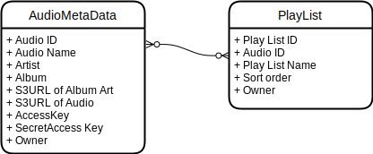

# The design of data store using Dynamodb.

## ER Diagrams

### Requirement
- Store user's metadata of audio in the 'Audio' table.
- Store user's play list in the 'PlayList' table.
- Users can access only their own data.

## Use case list
| #   | Entity        | Use Case     |
| --- | ------------- | ------------ |
| 1   | AudioMetaData | getAudioFilesByOwnaer |
| 2   | AudioMetaData | getArtistByOwner |
| 3   | AudioMetaData | getAudioFilesByArtistByOwner |
| 5   | AudioMetaData | getAudioFilesByAlbumByOwner |
| 6   | AudioMetaData | getAudioFilesByAlbumByOwner |
| 4   | AudioMetaData | getAlubmByOwner |
| 4   | AudioMetaData | getAlbm
compleetly rereased |
| 7   | PlayList | getUsersPlaylist |
| 8   | AudioMetaData | getAudioFilesByPlayListId |

## Schema definition

## Query condition definition